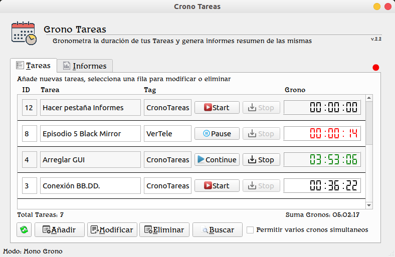

<h1> CronoTareas </h1>  

    

## Cronometra la duración de tus Tareas.  
## <i>Time the duration of your Tasks</i>
Hecha en Python 3.6.7 + PyQt5 + SQLite 3  
Versión 2.3 para Linux, testada únicamente en Ubuntu Budgie 18.04.4 LTS & Kubuntu 20.04  

<i>Made with Python 3.6.7 + PyQt5 + SQLite 3</i>  
<i>Linux version 2.3, tested only on Ubuntu Budgie 18.04.4 LTS & Kubuntu 20.04</i>  
  
Fernando Souto (donanpher@gmail.com)  
A Coruña (Galicia), Spain  
Abril 2020 (durante la cuarentena del #Coronavirus #SARS-CoV-2 #Covid-19)  
<i>April 2020 (during the #Coronavirus # SARS-CoV-2 # Covid-19 quarantine)</i>  

---

---
## Instalación en Linux <i>(Linux installation)</i>
* <a href="https://drive.google.com/file/d/1RqEKJ9KAFiXr-f8i49iwLoG_amduuJr4/view?usp=sharing">Descargar CronoTareas.zip (46 MB)</a>
* Descomprimelo en una nueva carpeta, por ejemplo /opt/cronotareas/
* Ejecuta CronoTareas (es un único fichero ejecutable creado con pyinstaller con todas las dependencias ya incluidas)
---
* <i><a href="https://drive.google.com/file/d/1RqEKJ9KAFiXr-f8i49iwLoG_amduuJr4/view?usp=sharing">Download CronoTareas.zip (46 MB)</a></i>   
* <i>Unzip it into a new folder, for example /opt/cronotareas/</i>   
* <i>Run CronoTareas (it's a single file build with pyinstaller with all dependencies included)</i>   
---
## Dependencias:  <i>(Dependencies)</i>
Python 3.6.7, PyQt5, SQLite 3  
<a href="https://github.com/donanpher/CronoTareas">Source Code on GitHub</a>
---
## Descripción General <i>(General Description)</i>
Aplicación para llevar el control de tiempo de distintas tareas.  
Se pueden añadir tantas tareas como se quiera, iniciarlas, pausarlas o detenerlas.  
<i>Application to take time control on your tasks</i>  
<i>You can add as many tasks as you want, start, pause, or stop them</i>  

### <b>Funciones:</b>  <i>(Functions)</i>
* Botón `Start`: Inicia una tarea y guarda la fecha y hora de ese inicio.  
* Botón `Pause`: Pausa la tarea y guarda la fecha y hora de esa pausa.
* Botón `Continue`: Reanuda la tarea y guarda la fecha y hora de la reanudación.  
* Botón `Stop`: Detiene la tarea y pregunta si se desea guardar el estado actual del Crono para una continuación posterior.  
* Cada combinación de ('Start' + 'Pause') o ('Continue' + 'Pause') genera un tramo de tiempo que queda almacenado en la base de datos.  
* En la pestaña de Informes se pueden consultar todos estos tramos de tiempo.  
* La elección entre guardar el Crono o no, no tiene repercusión en los informes. Es sólo a efectos visuales.  
* Se puede iniciar la aplicación con un argumento (el ID de la Tarea) para que dicha Tarea se inicie automáticamente con la aplicación.  
Por ejemplo: `$/opt/CronoTareas/CronoTareas 12` inicia la aplicación y pone en marcha el crono de la Tarea con ID=12
---
* <i>Button `Start`: Starts a task and saves its date & time</i>   
* <i>Button `Pause`: Pauses the task and saves its date & time</i>  
* <i>Button `Continue`: Resumes the task and save the date and time of the resume</i>  
* <i>Button `Stop`: Stop the task and ask if you want to save the current state of the Chrono for a later continuation</i>  
* <i>Each combination of ('Start' + 'Pause') or ('Continue' + 'Pause') generates a stretch of time that is stored in the database</i>  
* <i>In the Reports tab (Informes) you can see all these time sections</i>  
* <i>The choice between saving the Chrono or not has no impact on the reports. It is only for visual purposes.</i>  
* <i>You can start the application with an argument (the Task ID) so that the Task starts automatically with the application.</i>  
<i>For example: `$/opt/CronoTareas/CronoTareas 12` start the application and starts the Task Chrono with ID = 12</i> 
  
### <b>Tareas/Tags:</b>  <i>(Tasks/Tags)</i>
* Nombre de Tarea: Se refiere a una tarea particular y concreta dentro de un proyecto. Por ejemplo, elaborar documentación, codificar conexión a base de datos, etc.  
* Tag: Está a un nivel superior, se refiere al proyecto o cliente. Por ejemplo, Cliente X o Proyecto Y.  
Resumiendo: Los Tags incluyen Tareas.  
---
* <i>Task Name: Refers to a particular and concrete task within a project. For example, preparing documentation, coding database connection, etc.</i>  
* <i>Tag: It is at a higher level, it refers to the project or client. For example, Client X or Project Y</i>  
<i>Summarizing: Tags include Tasks</i>  

### <b>Tipos de Tareas:</b> (<i>recomendaciones de uso</i>):  <i>(Types of Tasks, recommendations of use)</i>
* Tareas recurrentes: Son tareas que se repiten en el tiempo, por ejemplo, ir a tomar un café. Al terminar la tarea, vuelvo a poner el crono a cero.  
* Tareas independientes: Son únicas y no se vuelven a repetir. En este tipo de tareas suelo guardar el crono para la siguiente vez, así veo continuamente el tiempo total acumulado.  
---
* <i>Recurring tasks: These are tasks that are repeated over time, for example, going for a coffee. At the end of the task, I reset the clock to zero.</i>  
* <i>Independent tasks: They are unique and do not happen again. In this type of tasks I usually save the chrono for the next time, so I can continuously see the total accumulated time</i>  

### <b>Cronómetros:</b>  (<i>Chronometers (Timers)</i>)
* La aplicación por defecto se inicia en modo mono-cronómetro, aunque se puede activar el modo multi-cronómetro en el checkbox.  
* Se pueden tener tantos cronómetros activos como se quiera.  
---
* <i>The application by default starts in mono-chrono mode, although you can activate the multi-chrono mode at checkbox</i>  
* <i>You can have as many timers (chronos) as you want</i>  

### <b>Informes:</b>  <i>(Reports)</i>
* Los informes resumen se basan todos en los tramos de tiempo generados por cada inicio, pausa y reanudación del Cronómetro.  
* El estado del Cronómetro en ningún momento se tiene en cuenta para generar informes.  
* Dada la posibilidad que se tiene de modificar un crono, existe la posibilidad de un descuadre entre el tiempo total del crono y el tiempo que sale en los informes.  
No se recomienda la modificación de los cronos por este motivo, si se hace es sólo a efectos visuales.  
* Exportación de informes a archivo CSV.  
---
* <i>Summary reports are all based on the time frames generated by each start, pause, and restart of the timer</i>  
* <i>The status of the Timer (Chrono) is never taken into account when generating reports</i>  
* <i>Given the possibility that you can to modify a chrono, there is the possibility of an imbalance between the total time of the chrono and the time that appears in the reports</i>  
* <i>The modification of the chrono is not recommended for this reason, if you do so, is only for visual purposes</i>  
* <i>Exporting reports to CSV file</i>  

---
